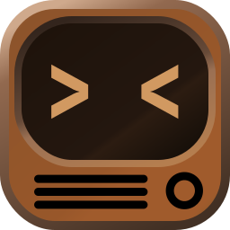

Twiskers
========

    
    &nbsp; &nbsp; &nbsp; &nbsp;
    

An alternative application icon for [Kitty](https://sw.kovidgoyal.net/kitty/) terminal emulator.
[JetBrains Mono](https://www.jetbrains.com/lp/mono/) font was used for angle brackets.

Name and Origin
---------------

I'd like to believe that "twisker" means "a combination of a nose twitch which makes the whiskers move", according to Urban Dictionary.
Otherwise, it's just the combination of TV and whiskers.

The original brown color of the Kitty icon was chosen, though the lightness differs.
Long ago, an old tube TV served as my monitor,
and I can't think of anything else that's brown and related to consoles other than a TV.
So, let it be TV.

Installation
------------

### Linux

1. Download one of the variants e.g. [`twiskers-light/twiskers-light-512x512.png`](https://github.com/igrmk/twiskers/raw/main/twiskers-light/twiskers-light-512x512.png)
   to your preferred icons path e.g. `~/.icons` or `~/.local/share/icons`.
2. Edit your `~/.local/share/applications/kitty.desktop` file and set the `Icon` parameter to the **absolute** path to the downloaded icon e.g. `/home/igrmk/.icons/twiskers-light-512x512.png`.

### macOS

See the official FAQ: [https://sw.kovidgoyal.net/kitty/faq/#i-do-not-like-the-kitty-icon](https://sw.kovidgoyal.net/kitty/faq/#i-do-not-like-the-kitty-icon)

Development
-----------

You need mac to build icons. Install inkscape and exiftool. Then run `build.sh` script.

Other alternatives
------------------

* https://github.com/igrmk/whiskers
* https://github.com/k0nserv/kitty-icon
* https://github.com/DinkDonk/kitty-icon
* https://github.com/hristost/kitty-alternative-icon
